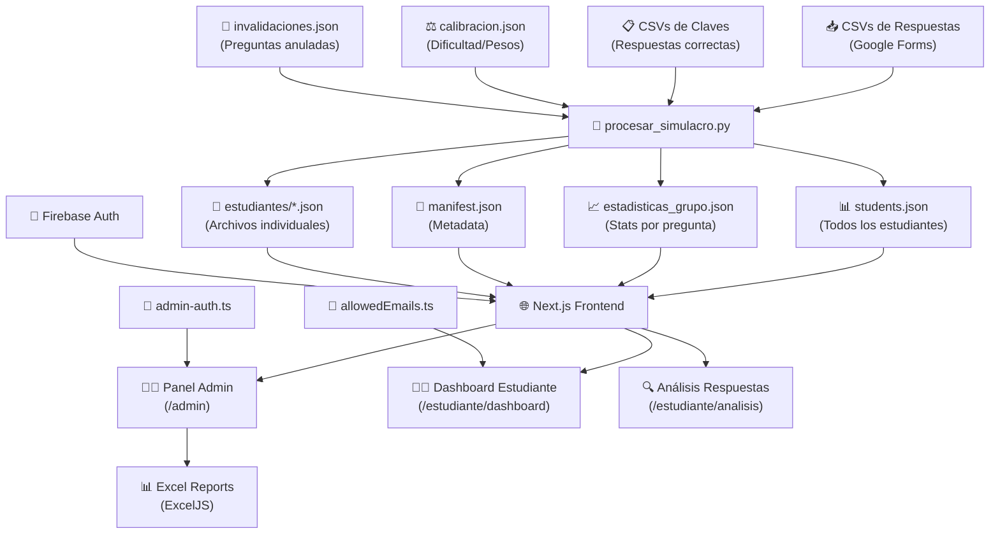

# 📖 Documentación Completa del Modelo — ReportesSG

> **Sistema integral de procesamiento, calificación y visualización de simulacros tipo ICFES Saber 11** para el programa educativo *Seamos Genios*.

---

## 📑 Tabla de Contenidos

1. [Visión General del Sistema](#1-visión-general-del-sistema)
2. [Arquitectura del Proyecto](#2-arquitectura-del-proyecto)
3. [Modelo de Datos — TypeScript](#3-modelo-de-datos--typescript)
4. [Backend Python — Procesamiento](#4-backend-python--procesamiento)
5. [Frontend Next.js — Visualización](#5-frontend-nextjs--visualización)
6. [Sistema de Calificación](#6-sistema-de-calificación)
7. [Sistema de Calibración](#7-sistema-de-calibración)
8. [Sistema de Invalidaciones](#8-sistema-de-invalidaciones)
9. [Autenticación y Seguridad](#9-autenticación-y-seguridad)
10. [Estructura de Datos en Disco](#10-estructura-de-datos-en-disco)
11. [Componentes React](#11-componentes-react)
12. [Scripts Auxiliares](#12-scripts-auxiliares)
13. [Flujo de Datos Completo](#13-flujo-de-datos-completo)

---

## 1. Visión General del Sistema

ReportesSG es una plataforma que:

1. **Ingesta** respuestas de estudiantes desde archivos CSV/XLSX.
2. **Califica** usando una curva no lineal basada en fórmulas ICFES.
3. **Calibra** la dificultad de preguntas según índice de acierto poblacional.
4. **Genera** archivos JSON con resultados individuales y estadísticas grupales.
5. **Visualiza** mediante una aplicación Next.js con panel administrativo y dashboard estudiantil.
6. **Exporta** reportes Excel profesionales con análisis estadístico avanzado.
7. **Protege** el acceso mediante Firebase Auth con Google Sign-In.

### Stack Tecnológico

| Capa | Tecnología | Propósito |
|:-----|:-----------|:----------|
| **Backend principal** | Python + Pandas | Procesamiento de simulacros |
| **Backend legacy** | Flask (`app.py`) | Servidor original con GUI web |
| **Frontend** | Next.js 14 + React + TailwindCSS | Dashboards administrativos y estudiantiles |
| **Autenticación** | Firebase Auth (Google) | Control de acceso por rol |
| **Base de datos** | Firestore (en migración) | Datos de estudiantes |
| **Exportación** | ExcelJS + FileSaver | Reportes XLSX profesionales |
| **Gráficos** | Chart.js + Framer Motion | Visualizaciones animadas |

---

## 2. Arquitectura del Proyecto

```
ReportesSG-main/
├── app.py                          # Servidor Flask (backend legacy)
├── procesar_simulacro.py           # Procesador independiente CLI
├── config/
│   ├── LOGICA_CALIFICACION.md      # Documentación de fórmulas
│   ├── NIVELES_DESEMPENO_OFICIAL.md # Niveles ICFES oficiales
│   └── .env                        # Variables de entorno
├── data/
│   └── input/
│       ├── SG11 - 08/              # Simulacro 08
│       │   ├── claves/             # CSVs con respuestas correctas
│       │   └── respuestas/         # CSVs con respuestas de estudiantes
│       ├── SG11 - 09/              # Simulacro 09
│       ├── calibracion.json        # Dificultad/peso de cada pregunta
│       └── invalidaciones.json     # Preguntas anuladas
├── scripts/
│   ├── core/
│   │   ├── procesar.py             # Procesador unificado CSV/XLSX
│   │   └── calibrador.py           # Generador de calibración
│   ├── ranking_analysis/           # Análisis de rankings nacionales
│   └── (otros scripts auxiliares)
├── reportes-sg-next/               # App Next.js
│   └── src/
│       ├── types/                  # Interfaces TypeScript
│       ├── lib/                    # Lógica de negocio
│       ├── utils/                  # Utilidades (feedback)
│       ├── config/                 # Configuración de seguridad
│       ├── components/             # 27 componentes React
│       └── app/                    # Rutas Next.js
│           ├── page.tsx            # Página de mantenimiento
│           ├── admin/page.tsx      # Panel administrativo
│           └── estudiante/
│               ├── dashboard/      # Dashboard del estudiante
│               └── analisis/       # Análisis de respuestas
└── output/                         # Reportes generados
```

---

## 3. Modelo de Datos — TypeScript

Todos los tipos están definidos en `reportes-sg-next/src/types/`.

### 3.1 `InformacionPersonal`

Datos de identificación del estudiante.

| Campo | Tipo | Descripción |
|:------|:-----|:------------|
| `nombres` | `string` | Nombres del estudiante |
| `apellidos` | `string` | Apellidos del estudiante |
| `tipo_identificacion` | `string` | Tipo de documento (CC, TI, etc.) |
| `numero_identificacion` | `string` | Número de documento (clave única) |
| `telefono` | `string` | Teléfono de contacto |
| `municipio` | `string` | Municipio de residencia |
| `correo_electronico?` | `string` | Email (opcional, extendido en `Estudiante`) |
| `institucion?` | `string` | Institución educativa (opcional) |

### 3.2 `PuntajeMateria`

Resultado en una materia individual.

| Campo | Tipo | Descripción |
|:------|:-----|:------------|
| `correctas` | `number` | Número de respuestas correctas |
| `total_preguntas` | `number` | Total de preguntas en la materia |
| `puntaje` | `number` | Puntaje calculado (0-100) usando la curva ICFES |

### 3.3 `RespuestaDetallada`

Detalle de una respuesta individual.

| Campo | Tipo | Descripción |
|:------|:-----|:------------|
| `numero` | `number` | Número de la pregunta |
| `respuesta_estudiante` | `string` | Opción seleccionada (A, B, C, D...) |
| `respuesta_correcta` | `string` | Clave correcta de la pregunta |
| `es_correcta` | `boolean` | Si la respuesta fue acertada |

### 3.4 `Estudiante` — Modelo Central

Entidad principal del sistema. Contiene toda la información de un estudiante.

| Campo | Tipo | Descripción |
|:------|:-----|:------------|
| `informacion_personal` | `InformacionPersonal & {...}` | Datos personales extendidos |
| `tipo` | `string` | Tipo de estudiante |
| `puntajes` | `{ [materia]: PuntajeMateria }` | Puntajes por cada materia |
| `respuestas_detalladas?` | `{ [materia]: RespuestaDetallada[] }` | Respuestas pregunta por pregunta |
| `score_reportado?` | `number` | Total de aciertos reportado |
| `score_real?` | `number` | Total de aciertos real |
| `puntaje_global` | `number` | Puntaje global (0-500) |
| `fecha?` | `string` | Timestamp de presentación |
| `secciones_completadas?` | `string[]` | Sesiones completadas (`["S1","S2"]`) |
| `sesiones?` | `string[]` | Alias de secciones |
| `s1_aciertos?` | `number` | Aciertos en Sesión 1 |
| `s1_total?` | `number` | Total preguntas Sesión 1 (120) |
| `s2_aciertos?` | `number` | Aciertos en Sesión 2 |
| `s2_total?` | `number` | Total preguntas Sesión 2 (134) |

**Materias disponibles** (5 áreas evaluadas):

| Clave interna | Nombre display | Color |
|:--------------|:---------------|:------|
| `lectura crítica` | Lectura Crítica | `#FF4D4D` |
| `matemáticas` | Matemáticas | `#33CCFF` |
| `sociales y ciudadanas` | Ciencias Sociales | `#FF8C00` |
| `ciencias naturales` | Ciencias Naturales | `#33FF77` |
| `inglés` | Inglés | `#B366FF` |

### 3.5 `DistribucionRespuestas`

Distribución de opciones seleccionadas por pregunta.

| Campo | Tipo | Descripción |
|:------|:-----|:------------|
| `A` - `D` | `number` | Cantidad que seleccionó cada opción |
| `E?` - `H?` | `number` | Opciones adicionales (inglés) |
| `NR` | `number` | No respondieron |

### 3.6 `EstadisticaPregunta`

Estadísticas de una pregunta a nivel grupal.

| Campo | Tipo | Descripción |
|:------|:-----|:------------|
| `numero` | `number` | Número de la pregunta |
| `respuesta_correcta` | `string` | Clave correcta |
| `distribucion` | `DistribucionRespuestas` | Distribución de respuestas |
| `porcentaje_acierto` | `number` | % de estudiantes que acertaron |
| `total_evaluados` | `number` | Total que respondieron |

### 3.7 `EstadisticasGrupo`

Contenedor de estadísticas grupales completas.

```typescript
{
  metadata: {
    total_evaluados: number;
    fecha_generacion: string;
  };
  materias: {
    [materia: string]: {
      [pregunta: string]: EstadisticaPregunta;
    };
  };
}
```

### 3.8 `DashboardStats`

Métricas computadas para el panel administrativo.

| Categoría | Campos | Descripción |
|:----------|:-------|:------------|
| **Básicas** | `promedio`, `maximo`, `minimo` | Estadísticas descriptivas |
| **Niveles** | `niveles: {superior, alto, medio, bajo}` | Distribución de niveles |
| **Avanzadas** | `mediana`, `desviacionEstandar`, `coeficienteVariacion` | Estadísticos avanzados |
| **Percentiles** | `percentil25`, `percentil75`, `percentil90`, `rangoIntercuartilico` | Análisis percentílico |
| **Tasas** | `tasaAprobacion`, `brechaMaxMin` | KPIs de rendimiento |
| **Materias** | `materiaMasDebil`, `materiaMasFuerte` | Materias extremas |
| **Tendencias** | `cambioPromedio?`, `cambioTasaAprobacion?` | Comparación con anterior |
| **Listas** | `top5`, `enRiesgo`, `promediosPorMateria` | Rankings y promedios |

### 3.9 `InstitucionData`

Agrupa estudiantes por institución.

| Campo | Tipo | Descripción |
|:------|:-----|:------------|
| `estudiantes` | `Estudiante[]` | Lista de estudiantes |
| `promedio` | `number` | Promedio institucional |
| `niveles` | `{superior, alto, medio, bajo}` | Conteo por nivel |

### 3.10 Tipos de Simulación (`simulation.ts`)

#### `SimulationManifest`

| Campo | Tipo | Descripción |
|:------|:-----|:------------|
| `id` | `string` | ID normalizado (`SG11-09`) |
| `name` | `string` | Nombre legible (`SG11 - 09`) |
| `date` | `string` | Fecha de procesamiento |
| `version` | `string` | Versión del formato |
| `totalStudents` | `number` | Total de estudiantes procesados |
| `sessions` | `string[]` | Sesiones incluidas |
| `generatedAt` | `string` | Timestamp de generación |

#### `SimulationStudentsFile`

| Campo | Tipo | Descripción |
|:------|:-----|:------------|
| `version` | `string` | Versión del schema |
| `simulationId` | `string` | ID del simulacro |
| `students` | `Record<string, Estudiante>` | Mapa ID → Estudiante |
| `index` | `string[]` | Array ordenado de IDs |

#### `CurrentSimulation`

| Campo | Tipo | Descripción |
|:------|:-----|:------------|
| `active` | `string` | Simulacro actualmente activo |
| `available` | `string[]` | Lista de simulacros disponibles |

---

## 4. Backend Python — Procesamiento

### 4.1 `procesar_simulacro.py` — Procesador CLI Principal

Script independiente que procesa simulacros completos.

**Uso:** `python procesar_simulacro.py "SG11 - 09"`

#### Funciones

| Función | Propósito |
|:--------|:----------|
| `calcular_puntaje_icfes(porcentaje)` | Aplica la curva no lineal ICFES (0-100) |
| `normalizar_id(simulacro_id)` | Normaliza ID para carpeta (`SG11 - 09` → `SG11-09`) |
| `normalizar_nombre_columna(col)` | Normaliza nombres de columna CSV |
| `cargar_claves(ruta_claves)` | Lee CSVs de claves y construye diccionario pregunta→respuesta |
| `cargar_calibracion()` | Carga `calibracion.json` con pesos/dificultades |
| `encontrar_columna(df, patrones)` | Busca columna por patrones fuzzy |
| `procesar_respuestas(ruta, claves)` | Procesa CSVs de respuestas → diccionario de estudiantes |
| `calcular_puntajes_finales(estudiantes, calibracion)` | Calcula puntajes con topes deslizantes |
| `guardar_resultados(simulacro_id, estudiantes)` | Genera todos los archivos de salida |
| `listar_simulacros()` | Lista simulacros disponibles en `data/input/` |

#### Flujo de `procesar_respuestas()`

1. Itera archivos CSV en la carpeta `respuestas/`.
2. Detecta la sesión (S1/S2) por nombre de archivo.
3. Busca columnas de información personal mediante patrones.
4. Para cada estudiante, inicializa su estructura de datos.
5. Procesa cada columna de pregunta (`[N]`):
   - Identifica la materia por nombre de columna.
   - Compara con la clave correcta (soporta respuestas múltiples tipo `A-B`).
   - Registra en `puntajes` y `respuestas_detalladas`.

### 4.2 `scripts/core/procesar.py` — Procesador Unificado

Versión avanzada con soporte CSV y XLSX, 1290 líneas.

**Funciones adicionales sobre el procesador principal:**

| Función | Propósito |
|:--------|:----------|
| `leer_archivo(ruta)` | Auto-detecta CSV o XLSX |
| `detectar_archivos()` | Encuentra archivos de respuestas y claves automáticamente |
| `generar_claves_identificacion(...)` | Genera múltiples claves de matching por estudiante |
| `cargar_invalidaciones()` | Carga preguntas invalidadas |
| `es_pregunta_invalidada(...)` | Verifica si una pregunta fue anulada |
| `procesar_sesion(...)` | Procesa una sesión completa |
| `calcular_puntaje_icfes_avanzado(...)` | Puntaje con pesos y penalización por inconsistencia |
| `calcular_racha_consecutiva(...)` | Analiza rachas de aciertos/errores consecutivos |
| `calcular_estadisticas_estudiante(...)` | Media, desviación, percentil, IC 95%, rachas |
| `calcular_estadisticas_grupo(...)` | Estadísticas a nivel grupal |
| `calcular_indice_global_colegio(...)` | Índice ICFES del colegio (top 80% de estudiantes) |

### 4.3 `scripts/core/calibrador.py` — Generador de Calibración

Analiza las respuestas de todos los estudiantes para calcular la dificultad de cada pregunta.

**Clasificaciones ICFES (Boletín 7):**

| Clasificación | Índice de Dificultad (p) | Peso | ¿Es Cáscara? |
|:-------------|:------------------------:|:----:|:------------:|
| `MUY_FACIL` | p ≥ 0.75 | 1 | ✅ |
| `FACIL` | 0.55 ≤ p < 0.75 | 1.5 | ✅ |
| `MEDIA` | 0.35 ≤ p < 0.55 | 2 | ❌ |
| `DIFICIL` | 0.25 ≤ p < 0.35 | 2.5 | ❌ |
| `MUY_DIFICIL` | p < 0.25 | 3 | ❌ |

> **"Cáscara"** = pregunta fácil que la mayoría acierta. Fallarla penaliza más.

### 4.4 `app.py` — Servidor Flask Legacy

Servidor web con GUI HTML, 1147 líneas. Funciones principales:

| Función | Propósito |
|:--------|:----------|
| `procesar_datos(df, prefijo)` | Procesa DataFrame con estadísticas |
| `generar_resultados_finales()` | Combina ambas sesiones |
| `calcular_estadisticas_grupo()` | Estadísticas por pregunta |
| `calcular_puntaje_materia_icfes(porcentaje)` | Curva "humanizada" original |
| `procesar_simulacro()` | Endpoint Flask para procesamiento |
| `upload_file()` | Upload de archivos CSV/XLSX |
| `actualizar_puntajes()` | Recalcula puntajes |

---

## 5. Frontend Next.js — Visualización

### 5.1 Rutas de la Aplicación

| Ruta | Componente | Descripción |
|:-----|:-----------|:------------|
| `/` | `MaintenancePage` | Página de mantenimiento (redirige admin) |
| `/admin` | `AdminPage` | Panel administrativo completo |
| `/estudiante/dashboard` | `StudentDashboard` | Dashboard personal del estudiante |
| `/estudiante/analisis` | `AnalisisRespuestasPage` | Análisis detallado de respuestas |

### 5.2 Panel Administrativo (`/admin`)

Página de 1572 líneas con pestañas:

| Pestaña | Icono | Funcionalidad |
|:--------|:-----:|:-------------|
| Dashboard | 📊 | Métricas generales, KPIs, histogramas |
| Análisis | 🧠 | Análisis de áreas y preguntas |
| Correlación | 🔗 | Matriz de correlación entre materias |
| Distribución | 📈 | Histograma interactivo |
| Estudiantes | 👥 | Tabla con todos los estudiantes |
| Instituciones | 🏫 | Ranking institucional |
| Departamentos | 🗺️ | Análisis geográfico |
| Alertas | ⚠️ | Estudiantes en riesgo, sesiones incompletas |

**Funciones internas clave:**

- `cargarSimulacros()`: Carga lista de simulacros disponibles desde `current_simulation.json`.
- `cargarDatos()`: Carga estudiantes y estadísticas, calcula `DashboardStats` completo.
- `calcularAciertosSesion()`: Determina aciertos S1 y S2 basándose en la distribución de materias.
- `handleExport()`: Exporta reportes Excel.

### 5.3 Dashboard del Estudiante (`/estudiante/dashboard`)

Página de 1016 líneas con vista personal.

**Flujo de carga:**

1. Verifica autenticación Firebase.
2. Detecta simulacros disponibles.
3. Carga ranking del simulacro activo.
4. Carga datos del estudiante individual.
5. Muestra métricas personales, puntajes por materia, posición en ranking.

**Funciones clave:**

- `fetchRanking()`: Carga `students.json` del simulacro activo.
- `fetchEstudiante()`: Busca datos del estudiante por email o ID.
- `detectarSimulacros()`: Detecta qué simulacros tiene datos el estudiante.
- `getNivel(puntaje)`: Clasifica nivel de desempeño con colores.

### 5.4 Análisis de Respuestas (`/estudiante/analisis`)

Página de 1168 líneas, muestra respuestas pregunta por pregunta.

- Vista de cuadrícula y vista de lista.
- Colorea correctas/incorrectas/invalidadas.
- Muestra estadísticas grupales comparativas.
- Carga `invalidaciones.json` para marcar preguntas anuladas.

### 5.5 Módulo `simulationLoader.ts`

Cargador de datos con caché en memoria.

| Función | Retorno | Descripción |
|:--------|:--------|:------------|
| `getCurrentSimulation()` | `CurrentSimulation` | Simulacro activo |
| `getSimulationManifest(simId)` | `SimulationManifest` | Metadata del simulacro |
| `loadStudents(simId?)` | `Estudiante[]` | Todos los estudiantes |
| `getStudentById(id, simId?)` | `Estudiante \| null` | Estudiante por ID |
| `loadStatistics(simId?)` | `EstadisticasGrupo` | Estadísticas grupales |
| `listAvailableSimulations()` | `string[]` | Lista de disponibles |
| `clearCache()` | `void` | Limpia caché |

Rutas de fetch:

- `/data/current_simulation.json`
- `/data/simulations/{simId}/students.json`
- `/data/simulations/{simId}/manifest.json`
- `/data/simulations/{simId}/estadisticas_grupo.json`

### 5.6 Módulo `feedbackGenerator.ts`

Clasifica el desempeño de un estudiante por materia.

**Niveles estadísticos por materia:**

| Materia | P25 | P50 | P75 | Tope |
|:--------|:---:|:---:|:---:|:----:|
| Lectura Crítica | 35 | 50 | 65 | 100 |
| Matemáticas | 35 | 50 | 70 | 100 |
| Sociales / Naturales | 40 | 55 | 70 | 100 |
| Inglés | 57 | 70 | 85 | 100 |

**`ANALIZAR_DESEMPENO(materia, puntaje)`**: Retorna nivel (1-4), etiqueta, distancia al siguiente nivel, progreso relativo, y colores CSS.

**`CALCULAR_CONSISTENCIA(respuestas)`**: Calcula racha máxima de aciertos consecutivos y tasa de error.

### 5.7 Módulo `reportGenerator.ts`

Genera reportes Excel profesionales de 1500 líneas. Incluye:

- Helpers estadísticos: media, desviación estándar, mediana, moda.
- `generateExcelReport()`: Genera un libro Excel completo con KPI cards, tablas detalladas, análisis por materia, correlación de Pearson, y más.

---

## 6. Sistema de Calificación

### 6.1 Puntaje por Área (0-100) — Curva No Lineal

La curva castiga el bajo rendimiento y premia la excelencia:

| Rango de % Aciertos | Fórmula | Puntaje Resultante |
|:--------------------|:--------|:------------------:|
| 100% | `100` (fijo) | 100 |
| ≥96% | `80 + ((% - 96) / 3.99) × 6` | 80-86 |
| ≥75% | `65 + ((% - 75) / 20) × 20` | 65-85 |
| ≥50% | `45 + ((% - 50) / 24) × 19` | 45-64 |
| ≥25% | `30 + ((% - 25) / 24) × 14` | 30-44 |
| <25% | `(% / 25) × 29` | 0-29 |

> **"El Salto al Vacío"**: Los puntajes 87-99 son *matemáticamente imposibles*. Solo se puede obtener 100 (sin errores) o máximo 86 (con errores).

### 6.2 Topes Deslizantes por Error

Además de la curva base, se aplican topes máximos según cantidad de errores:

| Materia | Tope con 1 Error | Penalidad por Error Adicional |
|:--------|:-----------------:|:----------------------------:|
| Matemáticas | 86 | -2 |
| Lectura Crítica | 82 | -2 |
| Sociales y Ciudadanas | 84 | -2 |
| Ciencias Naturales | 82 | -2 |
| Inglés | 87 | -2 |

El tope se reduce con cada error: `tope = tope_1_error - ((costo_errores - 1) × 2)`, mínimo 40.

### 6.3 Costos de Error por Dificultad

| Clasificación | Costo del Error |
|:-------------|:---------------:|
| MUY_FÁCIL | 1.3 |
| FÁCIL | 1.1 |
| MEDIA | 1.0 |
| DIFÍCIL | 0.7 |
| Otra | 0.5 |

### 6.4 Puntaje Global (0-500)

```
Puntaje Global = (Σ(Puntaje_Área × Peso)) / 13 × 5
```

**Pesos:** Matemáticas (3), Lectura Crítica (3), Sociales (3), Naturales (3), Inglés (1). Total = 13.

| Nivel | Rango Global |
|:------|:-----------:|
| Superior | ≥ 400 |
| Alto | 350-399 |
| Medio | 300-349 |
| Bajo | < 300 |

---

## 7. Sistema de Calibración

Archivo: `data/input/calibracion.json`

Cada pregunta tiene un registro:

```json
{
  "matemáticas_1": {
    "materia": "matemáticas",
    "numero": "1",
    "indice_dificultad": 0.7234,
    "clasificacion": "FACIL",
    "peso": 1.5,
    "es_cascara": true,
    "aciertos": 150,
    "total": 208,
    "sesion": "S1"
  }
}
```

**Penalización por inconsistencia**: Si un estudiante falla preguntas fáciles (cáscaras) pero acierta difíciles, se aplica penalización extra (hasta -10 puntos).

---

## 8. Sistema de Invalidaciones

Archivo: `data/input/invalidaciones.json`

```json
{
  "invalidaciones": [
    {
      "simulacro": "S11 S-08",
      "sesion": "S2",
      "numero_pregunta": 94,
      "materia": "inglés",
      "motivo": "Error de transcripción"
    }
  ]
}
```

Las preguntas invalidadas se marcan como correctas para **todos** los estudiantes. En el frontend se muestran con un indicador visual especial (badge amarillo).

---

## 9. Autenticación y Seguridad

### 9.1 Firebase Auth

Configuración en `lib/firebase.ts`. Usa Google Sign-In con:

- `apiKey`, `authDomain`, `projectId`, `storageBucket`, `messagingSenderId`, `appId`, `measurementId` desde variables de entorno.

### 9.2 Control de Acceso por Rol

| Rol | Archivo de Control | Verificación |
|:----|:-------------------|:-------------|
| **Admin** | `lib/admin-auth.ts` | `isAdmin(email)` — lista de 3 correos |
| **Estudiante** | `lib/allowedEmails.ts` | Array de ~200 correos autorizados |

Correos admin: `danielff999gf@gmail.com`, `seamosgenios@adpmh.com`, `adm.seamosgenios@gmail.com`

### 9.3 Seguridad del Cliente

`config/securityConfig.ts`:

- `disableConsoleAccess`: Bloquea DevTools (actualmente desactivado)
- `warningMessage`: Mensaje de advertencia

Componentes de seguridad:

- `SecurityProvider.tsx`: Proveedor de contexto de seguridad.
- `SecureSession.tsx`: Gestión de sesión segura.
- `DevToolsBlocker.tsx`: Bloqueo de herramientas de desarrollo.
- `BrowserHelpModal.tsx`: Ayuda con problemas de navegador/cookies.

---

## 10. Estructura de Datos en Disco

### 10.1 Archivos de Entrada (`data/input/`)

```
data/input/
├── SG11 - 08/
│   ├── claves/
│   │   ├── claves_sesion1.csv    # Columnas: NombrePregunta → RespuestaCorrecta
│   │   └── claves_sesion2.csv
│   └── respuestas/
│       ├── respuestas_sesion1.csv # Columnas: ID, Nombre, ... Pregunta[N]
│       └── respuestas_sesion2.csv
├── calibracion.json              # ~254 preguntas calibradas
└── invalidaciones.json           # Preguntas anuladas
```

### 10.2 Archivos de Salida (Simulaciones)

```
reportes-sg-next/public/data/
├── current_simulation.json              # {"active": "SG11-09", "available": [...]}
├── resultados_finales.json              # Copia global del último procesamiento
├── estadisticas_grupo.json              # Copia global
├── estudiantes/                         # JSON individual por estudiante
│   ├── 1234567890.json
│   └── ...
└── simulations/
    ├── SG11-08/
    │   ├── manifest.json                # Metadata del simulacro
    │   ├── students.json                # Todos los estudiantes
    │   ├── resultados_finales.json      # Resultados completos
    │   ├── estadisticas_grupo.json      # Stats por pregunta
    │   └── estudiantes/                 # Archivos individuales
    └── SG11-09/
        └── (misma estructura)
```

---

## 11. Componentes React

### 11.1 Componentes de Visualización

| Componente | Líneas | Propósito |
|:-----------|:------:|:----------|
| `DashboardOverview.tsx` | 306 | Vista general con KPIs, histograma, radar |
| `AnalisisArea.tsx` | ~800+ | Análisis detallado por área/pregunta |
| `HistogramaInteractivo.tsx` | ~550 | Histograma interactivo de distribución |
| `RadarChart.tsx` | ~260 | Gráfico radar de materias |
| `CorrelationMatrix.tsx` | ~255 | Matriz de correlación entre materias |
| `AnimatedGauge.tsx` | ~166 | Gauge animado (0-500) |
| `AnimatedPercentileGauge.tsx` | ~89 | Gauge de percentil |
| `ProfileByLevel.tsx` | ~265 | Perfil por nivel de desempeño |

### 11.2 Componentes de Estudiante

| Componente | Propósito |
|:-----------|:----------|
| `TarjetaEstudiante.tsx` | Tarjeta resumen del estudiante |
| `StudentDetailModal.tsx` | Modal con detalles completos |
| `StudentInsightCard.tsx` | Tarjeta de insights IA |
| `StudentComparisonView.tsx` | Comparación entre estudiantes |
| `StudentComparisonBar.tsx` | Barra de comparación visual |

### 11.3 Componentes de UI/UX

| Componente | Propósito |
|:-----------|:----------|
| `SlidingPillNav.tsx` | Navegación tipo pastilla deslizante |
| `MetricCard.tsx` | Tarjeta de métrica KPI |
| `InsightCard.tsx` | Tarjeta de insight con `AutoInsights` |
| `FloatingActionBar.tsx` | Barra flotante de acciones |
| `ExportMenu.tsx` | Menú de exportación |
| `ExportPreviewModal.tsx` | Vista previa de exportación (1200+ líneas) |
| `Modal.tsx` | Componente modal genérico |
| `LiquidEther.jsx` | Efecto visual background animado |

### 11.4 Componentes de Sistema

| Componente | Propósito |
|:-----------|:----------|
| `InvalidacionesManager.tsx` | Gestión de preguntas invalidadas |
| `FirestoreMigration.tsx` | Migración de datos a Firestore |
| `SecurityProvider.tsx` | Proveedor de seguridad |
| `SecureSession.tsx` | Sesión segura |
| `DevToolsBlocker.tsx` | Bloqueador de DevTools |
| `BrowserHelpModal.tsx` | Ayuda con navegador |

---

## 12. Scripts Auxiliares

| Script | Propósito |
|:-------|:----------|
| `add_emails_to_auth.py` | Agrega emails a Firebase Auth |
| `migrate_students.py` | Migra datos de estudiantes |
| `optimize_web_data.py` | Optimiza JSONs para web |
| `sync_individual_files.py` | Sincroniza archivos individuales |
| `sync_resultados_finales.py` | Sincroniza resultados finales |
| `verify_data.py` | Verifica integridad de datos |
| `verify_auth.py` | Verifica autenticación |
| `calculate_question_stats.py` | Calcula estadísticas por pregunta |
| `corregir_nombres.py` | Corrige nombres malformados |
| `diagnostico_puntajes.py` | Diagnóstico de puntajes |
| `recalibrar_*.py` | Scripts de recalibración (5 variantes) |
| `simular_curva.py` | Simulador de la curva de calificación |
| `ranking_analysis/*.py` | Análisis de rankings nacionales Milton Ochoa |
| `generar_estadisticas.py` | Generador de estadísticas |

---

## 13. Flujo de Datos Completo



### Paso a paso

1. **Recolección**: Los estudiantes responden formularios Google que generan CSVs.
2. **Preparación**: Se colocan CSVs de claves y respuestas en `data/input/SG11-XX/`.
3. **Calibración** (opcional): Se ejecuta `calibrador.py` para generar `calibracion.json`.
4. **Procesamiento**: Se ejecuta `procesar_simulacro.py "SG11 - XX"`.
5. **Generación**: Se crean `students.json`, `estadisticas_grupo.json`, `manifest.json` y archivos individuales.
6. **Visualización**: La app Next.js carga los JSONs y renderiza dashboards.
7. **Exportación**: Los administradores pueden generar reportes Excel.
8. **Acceso**: Firebase controla autenticación; listas de emails controlan autorización.

---

> *Documento generado el 9 de Febrero de 2026 — Versión completa del modelo ReportesSG*
